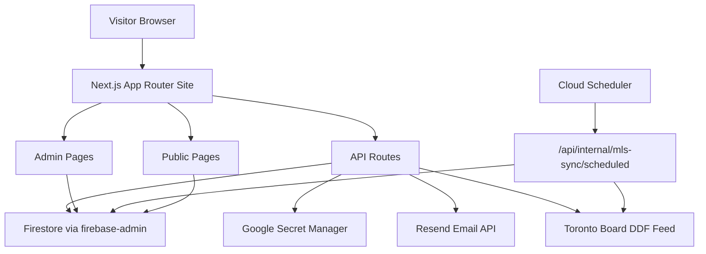

# HomeScope GTA Infrastructure Guide

This document is the full technical blueprint for HomeScope GTA as it exists in the current codebase. It is written so the project can be recreated, deployed, and operated in a new environment with minimal guesswork.

## 1. System Overview

HomeScope GTA is a Next.js 14 App Router application for:

- public GTA real estate listings
- buyer and renter guide content
- showing requests and contact capture
- MLS listing sync from a Toronto Board DDF feed
- operational admin tools
- on-site chatbot and search logging

Primary technologies:

- Next.js 14.2.35
- React 18.3.1
- TypeScript 5.5.3
- Tailwind CSS 3.4.6
- Firebase Admin SDK
- Cloud Firestore
- Google Secret Manager
- Resend email API
- Leaflet / React Leaflet for map display

Current repository root:

- `C:\projects\HomeScopeGTA`

## 2. High-Level Architecture

## 3. Repository Structure

Top-level directories:

- `app`
  - App Router pages and API routes
- `components`
  - UI and feature components
- `config`
  - site and listings configuration
- `data`
  - debug payloads and sample feed data
- `firebase`
  - Firebase Functions subproject scaffolding
- `lib`
  - business logic, Firestore access, sync logic, email, chat, settings
- `public`
  - static assets such as logos, PDF forms
- `types`
  - shared TypeScript types

Important top-level files:

- `package.json`
- `next.config.mjs`
- `tailwind.config.ts`
- `firebase.json`
- `firestore.rules`
- `firestore.indexes.json`
- `middleware.ts`
- `.env.example`

## 4. Runtime Architecture

### 4.1 Public site

The public site is rendered by Next.js App Router.

Key public routes:

- `/`
- `/listings`
- `/listings/[slug]`
- `/contact`
- `/guides`
- `/guides/first-time-home-buyer-ontario`
- `/guides/documents-needed-buy-house-toronto`
- `/guides/organize-real-estate-documents-canada`
- `/guides/rental-application-ontario`
- `/guides/buying`
- `/guides/leasing`
- `/guides/lease-documents`
- `/thank-you/showing-request`
- `/robots.txt`
- `/sitemap.xml`

### 4.2 Admin site

Admin pages live under `/admin` and are protected by middleware.

Admin routes:

- `/admin`
- `/admin/login`
- `/admin/sync`
- `/admin/featured`
- `/admin/leads`
- `/admin/contacts`

Auth mechanism:

- middleware in `middleware.ts`
- auth cookie name:
  - `homescope_admin_token`
- login checks the submitted token against:
  - `MLS_SYNC_ADMIN_TOKEN`
- cookie is:
  - `httpOnly`
  - `sameSite=lax`
  - `secure` in production
  - path-scoped to `/admin`

### 4.3 API routes

Primary API routes:

- `POST /api/contact`
- `POST /api/leads`
- `POST /api/searches`
- `POST /api/chat`
- `POST /api/listings/map`
- `POST /api/admin/auth/login`
- `POST /api/admin/auth/logout`
- `GET /api/admin/listings-stats`
- `POST /api/admin/mls-sync`
- `DELETE /api/admin/mls-sync`
- `POST /api/internal/mls-sync/scheduled`

## 5. Data Layer

### 5.1 Firestore access model

The application uses only the server-side Firebase Admin SDK for writes and privileged reads.

Core file:

- `lib/firebase/admin.ts`

Initialization requirements:

- `FIREBASE_PROJECT_ID`
- `FIREBASE_CLIENT_EMAIL`
- `FIREBASE_PRIVATE_KEY`

Notes:

- `FIREBASE_PRIVATE_KEY` must preserve line breaks; the code converts escaped `\\n` to real newlines.
- No Firebase web client SDK is currently required for core site features.

### 5.2 Firestore collections in active use

Observed collections:

- `listings`
- `listingSnapshots`
- `settings`
- `leads`
- `contactMessages`
- `contacts`
- `searches`
- `chatConversations`
- `communications` (present in codebase)

### 5.3 Collection purposes

#### `listings`

Stores normalized public and private listing data from the MLS sync.

Used by:

- public listing pages
- maps
- featured listing selection
- sync jobs
- admin stats

Important fields seen in code:

- `listingId`
- `mlsNumber`
- `slug`
- `municipality`
- `transactionType`
- `propertyType`
- `propertyClass`
- `price`
- `bedrooms`
- `bathrooms`
- `images`
- `coordinates`
- `publicRemarks`
- `isVisible`
- `permToAdvertise`
- `hiddenReason`
- `listAgentKey`
- `badges`

#### `listingSnapshots`

Stores listing change snapshots for sync history and record comparison.

#### `settings`

Stores application-level operational state and site settings.

Known documents:

- `site`
  - `leadRecipientEmail`
  - `leadEmailSubject`
  - `featuredListingIds`
- `mlsFullSyncCursor`
- `mlsIncrementalCursor`
- `mlsSchedulerStatus`
- sync stop signal document(s)

#### `leads`

Stores showing requests and related capture info.

Fields include:

- person name
- email
- phone
- target listing details
- message
- transaction type
- SMS consent flag
- email delivery status

#### `contactMessages`

Stores contact form submissions and email-delivery metadata.

#### `contacts`

Acts as a deduplicated contact profile layer aggregated from leads and contact messages.

Fields include:

- `fullName`
- `email`
- `phone`
- `smsConsent`
- `smsConsentUpdatedAt`
- `leadCount`
- `contactMessageCount`
- `searchCriteria`
- `recentListings`

#### `searches`

Stores listing-search telemetry from public users.

Fields include:

- `path`
- `queryString`
- `resultsTotal`
- `filters`
- `userAgent`

#### `chatConversations`

Stores website chatbot conversations.

Fields include:

- `id`
- `createdAt`
- `updatedAt`
- `source`
- `pagePaths`
- `userAgent`
- `messages[]`

## 6. Firestore Rules and Access Model

Rules file:

- `firestore.rules`

Current access model:

- public read allowed only for `listings` where:
  - `isVisible == true`
  - `permToAdvertise == true`
  - municipality in:
    - Aurora
    - Newmarket
    - Richmond Hill
    - Vaughan
    - King
    - Toronto
- all writes are server-only
- private collections are not publicly readable

Important note:

The rules file does **not yet explicitly mention** newer collections like:

- `contacts`
- `searches`
- `chatConversations`

Because all unmatched paths are denied by default in Firestore rules, this is still safe, but if rules are ever broadened later, this should be reviewed.

## 7. Search, Leads, Contact, and Chat Flows

### 7.1 Showing requests

Frontend:

- `components/leads/lead-capture-modal.tsx`

API:

- `app/api/leads/route.ts`

Flow:

1. user opens lead modal from listing page
2. submits name, email, phone, message, consent
3. API validates payload
4. saves to `leads`
5. upserts `contacts`
6. email delivery is handled downstream through the email service / trigger pattern
7. user is redirected to:
   - `/thank-you/showing-request`

### 7.2 Contact form

Frontend:

- `components/contact/contact-form.tsx`

API:

- `app/api/contact/route.ts`

Flow:

1. validation
2. save to `contactMessages`
3. upsert `contacts`
4. send contact notification email through `lib/email`
5. save email delivery status back to Firestore

### 7.3 Search tracking

Frontend:

- `components/listings/search-tracker.tsx`

API:

- `app/api/searches/route.ts`

Storage:

- `lib/searches/store.ts`

### 7.4 Chatbot

Frontend:

- `components/chat/site-chatbot.tsx`

API:

- `app/api/chat/route.ts`

Logic:

- `lib/chat/build-chat-response.ts`

Storage:

- `lib/chat/store.ts`

Current chatbot behavior:

- rule-based site assistant
- no external LLM dependency
- answers using the site’s guides and process knowledge
- suggests relevant guide links
- conversation persisted to Firestore

## 8. Email Infrastructure

Email module:

- `lib/email/index.ts`

Providers in code:

- Resend
- Mock console provider
- SendGrid provider file exists in codebase

Current provider selection logic:

- `EMAIL_ENABLED === "true"`
- `EMAIL_PROVIDER` must be `resend`
- requires:
  - `RESEND_API_KEY`
  - `FROM_EMAIL`

If provider is missing or unsupported:

- a mock provider is used
- Firestore still records the submission
- operational logs explain the mode

Site settings influence recipient and subject:

- Firestore `settings/site`
- fallback env:
  - `LEADS_NOTIFICATION_EMAIL`
  - `LEAD_EMAIL_SUBJECT`

## 9. MLS Sync Architecture

### 9.1 Purpose

The MLS sync pulls listing data from a Toronto Board DDF feed, normalizes it, filters it, stores it in Firestore, and updates listing visibility.

Main sync module:

- `lib/mls`

Important sync files:

- `lib/mls/sync/createConnector.ts`
- `lib/mls/sync/runSync.ts`
- `lib/mls/sync/runFullSync.ts`
- `lib/mls/sync/runIncrementalSync.ts`
- `lib/mls/sync/runStaleCleanup.ts`
- `lib/mls/sync/fullSyncCursor.ts`
- `lib/mls/sync/incrementalSyncCursor.ts`
- `lib/mls/sync/stopSignal.ts`
- `lib/mls/sync/publicQueries.ts`
- `lib/mls/sync/cleanupMisclassifiedKingstonListings.ts`

### 9.2 Connectors

Current connector kind in env:

- `ddf-treb`

Relevant environment variables:

- `DDF_TOKEN_URL`
- `DDF_LISTINGS_URL`
- `DDF_REPLICATION_URL`
- `DDF_CLIENT_ID`
- `DDF_CLIENT_SECRET`
- `DDF_SCOPE`
- `DDF_TOP_PARAM`
- `DDF_SINCE_FILTER_FIELD`
- `DDF_PAGE_SIZE`
- `DDF_REQUEST_TIMEOUT_MS`
- `DDF_MAX_RETRIES`

### 9.3 Full sync

Manual trigger:

- `POST /api/admin/mls-sync`
  - body can specify:
    - `mode: "full"`
    - `resetCursorToFirstPage: true`

Cursor document:

- `settings/mlsFullSyncCursor`

Page limit control:

- `MLS_FULL_SYNC_MAX_PAGES_PER_RUN`

### 9.4 Incremental sync

Manual or scheduled.

Scheduled route:

- `POST /api/internal/mls-sync/scheduled`

Header required:

- `x-scheduler-token`

Configured token:

- `MLS_SCHEDULER_TOKEN`

Cursor document:

- `settings/mlsIncrementalCursor`

### 9.5 Sync cleanup and special fixes

Current special cleanup exists for misclassified `King` municipality imports:

- removes listings that appear to actually be from:
  - Kingston
  - Kingsville

That logic runs at the start of both:

- full sync
- incremental sync

### 9.6 Scheduler status

Nightly incremental status is written to:

- `settings/mlsSchedulerStatus`

Fields include:

- `lastRunAt`
- `lastRunMode`
- `lastRunStatus`
- `lastRunCounts`
  - `fetched`
  - `filtered`
  - `created`
  - `updated`
  - `archived`
  - `failed`
- `lastError`

## 10. Secrets and Configuration

### 10.1 Secret Manager

Secret loading logic:

- `lib/server/secret-manager.ts`

Behavior:

- attempts to load missing server-side env vars from Google Secret Manager
- caches loaded values in-process
- supports on-demand resolution

Default secret names include:

- `DDF_CLIENT_ID`
- `DDF_CLIENT_SECRET`
- `DDF_TOKEN_URL`
- `DDF_LISTINGS_URL`
- `DDF_REPLICATION_URL`
- `DDF_SCOPE`
- `MLS_CONNECTOR_KIND`
- `MLS_SYNC_ADMIN_TOKEN`
- `MLS_SCHEDULER_TOKEN`
- `RESEND_API_KEY`
- `FROM_EMAIL`
- `EMAIL_PROVIDER`
- `EMAIL_ENABLED`

Optional controls:

- `GCP_SECRET_NAMES`
- `SECRETS_AUTOLOAD_DISABLED=true`

### 10.2 Environment variables

Source of truth for required variables:

- `.env.example`

Important groups:

#### Public metadata / analytics

- `NEXT_PUBLIC_SITE_URL`
- `NEXT_PUBLIC_GA_MEASUREMENT_ID`
- `NEXT_PUBLIC_META_PIXEL_ID`
- `NEXT_PUBLIC_GOOGLE_SITE_VERIFICATION`

#### Firebase Admin

- `FIREBASE_PROJECT_ID`
- `FIREBASE_CLIENT_EMAIL`
- `FIREBASE_PRIVATE_KEY`
- `FIREBASE_USE_EMULATOR`
- `FIRESTORE_EMULATOR_HOST`

#### Email

- `EMAIL_PROVIDER`
- `EMAIL_ENABLED`
- `LEADS_NOTIFICATION_EMAIL`
- `LEAD_EMAIL_SUBJECT`
- `FROM_EMAIL`
- `RESEND_API_KEY`

#### DDF / sync

- `MLS_SOURCE_SYSTEM`
- `MLS_CONNECTOR_KIND`
- `MLS_PAGE_SIZE`
- `MLS_FULL_SYNC_MAX_PAGES_PER_RUN`
- `MLS_SNAPSHOTS_ENABLED`
- `MLS_CLEANUP_ENABLED`
- `MLS_STRICT_PUBLIC_FIELDS`
- `MLS_STALE_THRESHOLD_HOURS`
- `MLS_SYNC_ADMIN_TOKEN`
- `MLS_SCHEDULER_TOKEN`

#### Sync schedule declarations

- `SYNC_FULL_CRON`
- `SYNC_INCREMENTAL_CRON`
- `SYNC_CLEANUP_CRON`
- `SYNC_STALE_THRESHOLD_HOURS`

## 11. Deployment Model

### 11.1 Current likely target

This codebase is structured well for:

- Firebase App Hosting or other Node-hosted Next.js deployment
- Cloud Firestore backend
- Cloud Scheduler hitting HTTP routes
- Secret Manager for protected credentials

The repository contains:

- `firebase.json`
- Firebase Functions scaffolding under `firebase/functions`

But the main app itself is the Next.js site in the root, not the functions subproject.

### 11.2 Build settings

`package.json` scripts:

- `npm run dev`
- `npm run build`
- `npm run start`
- `npm run lint`
- `npm run typecheck`

`next.config.mjs`:

- `reactStrictMode: true`
- remote image support for:
  - `images.unsplash.com`
  - `ddfcdn.realtor.ca`

### 11.3 Installation into a new environment

If you need to install this somewhere else, follow this order.

#### Step 1. Prepare the new code host

- copy the repository
- install Node.js 20+ recommended
- install npm dependencies:
  - `npm install`

#### Step 2. Create the Firebase / GCP project

- create a new Firebase project
- enable Firestore
- create or use a service account with:
  - Firestore access
  - Secret Manager Secret Accessor

#### Step 3. Set up Firestore

- deploy rules:
  - `firestore.rules`
- deploy indexes:
  - `firestore.indexes.json`
- verify collections can be created by server writes

#### Step 4. Create required secrets and env vars

At minimum:

- Firebase Admin credentials
- DDF credentials
- admin token
- scheduler token
- email provider secrets
- public site URL
- analytics IDs if used

#### Step 5. Configure site settings in Firestore

Create or update:

- `settings/site`

Recommended fields:

- `leadRecipientEmail`
- `leadEmailSubject`
- `featuredListingIds`

#### Step 6. Configure DNS and canonical domain

Production domain should resolve to the host running the Next.js app.

Current expected canonical domain:

- `https://homescopegta.ca`

If moving to a different domain:

- update `NEXT_PUBLIC_SITE_URL`
- redeploy
- verify:
  - `sitemap.xml`
  - `robots.txt`
  - metadata

#### Step 7. Configure Scheduler

Create an HTTP scheduler job that calls:

- `POST /api/internal/mls-sync/scheduled`

Required header:

- `x-scheduler-token: <MLS_SCHEDULER_TOKEN>`

Current documented schedule in UI behavior:

- nightly incremental is expected operationally

#### Step 8. Run initial sync

After deployment:

1. log into `/admin`
2. open `/admin/sync`
3. run sync
4. verify listing counts
5. verify municipality filtering

#### Step 9. Verify user-facing systems

Test:

- contact form
- showing request form
- thank-you redirect page
- search logging
- chatbot
- guide links
- featured listings
- map load

## 12. Recommended Migration Checklist for a New Installation

When moving to a new environment, complete all of the following:

- deploy code
- set all env vars
- confirm Firebase Admin credentials work
- confirm Secret Manager access works
- deploy Firestore rules and indexes
- create `settings/site`
- configure admin token
- configure scheduler token
- configure email provider
- verify `/sitemap.xml`
- verify `/robots.txt`
- run first sync
- verify admin dashboard counts
- verify lead and contact records are saved
- verify search logs are created
- verify chatbot conversations are saved

## 13. Known Operational Constraints

- Search Console internal-link reporting can lag behind actual site links.
- Listing detail pages rely on Firestore data quality and sync consistency.
- The chatbot is currently deterministic and guide-backed, not LLM-backed.
- Sync correctness depends heavily on DDF payload field quality.
- Municipality edge cases like Kingston and Kingsville have custom cleanup logic.

## 14. Recommended Improvements

If this system is being hardened for long-term production, the next worthwhile steps are:

- add explicit Firestore rules coverage for all newer collections
- add backups/export plan for Firestore
- add environment-specific docs for staging vs production
- add healthcheck endpoint
- add monitoring and alerting for sync failures
- add error reporting (for example Sentry)
- add AI-backed chatbot if broader conversational coverage is needed
- add automated smoke tests for lead, contact, and sync routes

## 15. File Map for Key Infrastructure

Public shell:

- `app/layout.tsx`
- `components/layout/site-header.tsx`
- `components/layout/site-footer.tsx`

Config:

- `config/site.ts`
- `config/listings.ts`

Firebase:

- `lib/firebase/admin.ts`
- `firestore.rules`
- `firestore.indexes.json`
- `firebase.json`

Secrets:

- `lib/server/secret-manager.ts`

MLS sync:

- `lib/mls/sync/*`
- `app/api/admin/mls-sync/route.ts`
- `app/api/internal/mls-sync/scheduled/route.ts`

Listings:

- `lib/listings/service.ts`
- `lib/listings/firestore-data.ts`
- `components/listings/*`

Leads and contacts:

- `app/api/leads/route.ts`
- `app/api/contact/route.ts`
- `lib/leads/store.ts`
- `lib/leads/contact-store.ts`
- `lib/leads/contacts-store.ts`

Search logging:

- `app/api/searches/route.ts`
- `lib/searches/store.ts`

Chatbot:

- `components/chat/site-chatbot.tsx`
- `app/api/chat/route.ts`
- `lib/chat/build-chat-response.ts`
- `lib/chat/store.ts`

SEO:

- `app/sitemap.ts`
- `app/robots.ts`
- page-level metadata in route files

## 16. Final Summary

HomeScope GTA is a server-rendered Next.js application backed by Firestore, Secret Manager, an MLS DDF sync pipeline, admin-only operational pages, structured guide content, lead/contact capture, search analytics persistence, and a Firestore-backed chatbot.

To recreate it elsewhere, the essential pillars are:

- Next.js deployment
- Firestore
- Firebase Admin credentials
- Secret Manager
- DDF feed credentials
- scheduler HTTP trigger
- email provider
- Firestore rules and indexes
- `settings/site` bootstrap document

If all of those are reproduced, the application can be stood up in another environment with the same core behavior.
